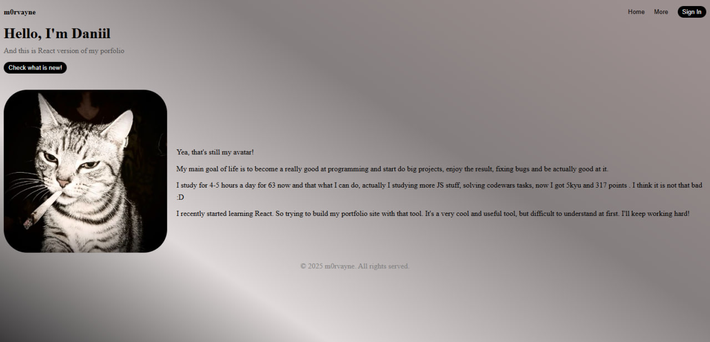

# m0rvayne — React Portfolio

## About Me
- **Junior Frontend Developer**
- **61 days self-study** (4–5 hours daily)
- **Codewars: 5 kyu, 317 points**
- **React** (hooks, useState, useEffect)

## Features
- **Interactive buttons** with animations
- **Hover avatar effect**
- **Gradient background**
- **Responsive design**
- **Async effects** 

## Tech Stack
- **React 19** (hooks)
- **CSS3** (Flexbox, transitions)
- **JavaScript ES6+**

## Live Demo
[View Live](https://morvayne1.github.io/m0rvayne-react-portfolio)

---
**Relocating to Cluj-Napoca, Romania**  
**Open for junior React roles!**